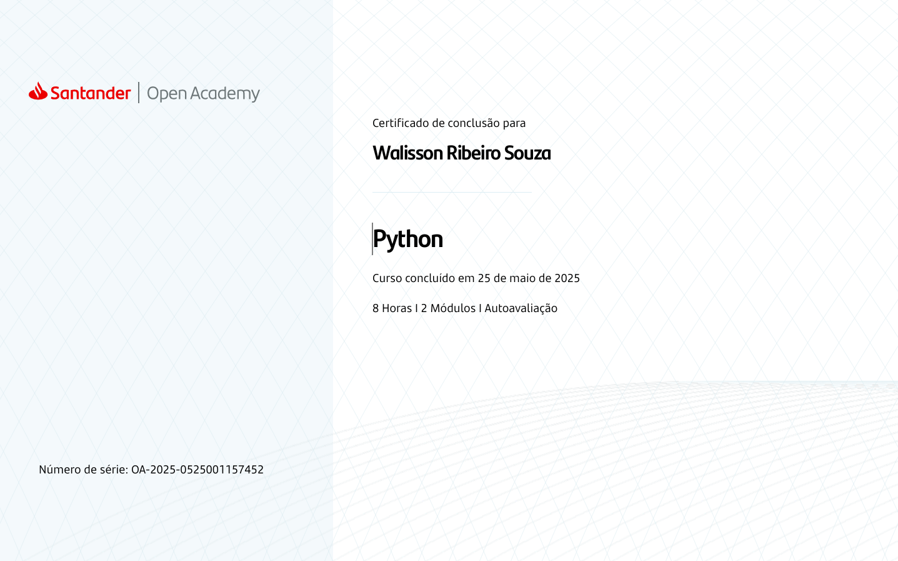

# 🐍 Praticando Python

Este repositório tem como objetivo registrar meus avanços e aprendizados durante meus estudos em Python. Aqui estão reunidos exercícios, anotações e pequenos projetos feitos ao longo do tempo.

## 🧠 Objetivos

- Praticar a lógica de programação com Python
- Aprender conceitos essenciais da linguagem
- Criar pequenos scripts e projetos úteis
- Registrar meu progresso

## 🗂️ Organização

O repositório está dividido em pastas conforme os tópicos ou tipos de exercício:

- `exercicios_basicos/` — comandos simples, variáveis, condicionais, laços
- `funcoes/` — prática com funções e escopo
- `estruturas_de_dados/` — listas, tuplas, dicionários e conjuntos
- `projetos/` — pequenos projetos práticos
- `anotacoes/` — resumos e exemplos explicativos

## 🚀 Em andamento

- [x] Instalação do Python e Git
- [x] Primeiros scripts no terminal
- [x] Revisão de estruturas de repetição
- [x] Projeto simples com interface

## 📌 Tecnologias

- Python 3.x
- Git + GitHub
- VS Code (como editor)

## 🙋‍♂️ Sobre mim

Meu nome é **Walisson**, e este repositório é parte da minha rotina de estudos. Estou documentando tudo o que aprendo para reforçar o conhecimento e também ajudar outras pessoas iniciantes.

---

Se quiser usar ou contribuir com alguma ideia, fique à vontade!

